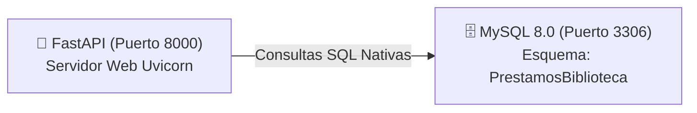

# 📚 Sistema de Gestión de Biblioteca - API REST

Esta API REST constituye el núcleo de backend para un sistema de gestión bibliotecaria desarrollado bajo el ecosistema de **FastAPI** (Python) y respaldado por una base de datos relacional **MySQL** para la persistencia permanente de los registros del catálogo.

El sistema opera bajo una arquitectura cliente-servidor estructurada, procesando peticiones HTTP estándar (GET, POST, PUT, DELETE) y comunicándose estrictamente a través del formato de intercambio de datos **JSON**. Su funcionamiento cubre de forma íntegra las operaciones CRUD del catálogo de libros, garantizando en todo momento la integridad referencial y el rendimiento de las consultas.

---

## 🛠️ Arquitectura y Componentes del Sistema

El entorno completo está completamente contenedorizado mediante **Docker** y **Docker Compose**, lo que garantiza un despliegue aislado, reproducible y seguro de los servicios a través de una red virtual local interna.



La infraestructura está compuesta por dos servicios principales orquestados:

| Servicio | Puerto Interno | Descripción Técnica |
| :--- | :---: | :--- |
| **mysql** | `3306` | Base de datos relacional con volumen local asignado para garantizar la persistencia de datos independiente del ciclo de vida del contenedor. |
| **python** | `8000` | API FastAPI montada sobre un servidor web ASGI Uvicorn con políticas de *Live Reload* activas para desarrollo ágil. |

---

## 🚀 Documentación de Endpoints y Operaciones CRUD

A continuación se detallan las operaciones de persistencia implementadas sobre la tabla física `Libro` de la base de datos relacional. Todas las rutas responden con los códigos de estado HTTP estandarizados por la IETF.

### 1. Rutas de Control de Estado (Health Check)
* `GET /` : Endpoint raíz que devuelve el mensaje de bienvenida y estado inicial del servidor.
* `GET /health` : Verifica la conectividad interna y latencia entre el contenedor de la API y el motor MySQL.
* `GET /docs` : Interfaz gráfica interactiva y autogenerada para pruebas de rendimiento (**Swagger UI**).

### 2. Gestión del Catálogo de Libros

#### 🔹 Listar todos los libros (`GET /books/`)
Realiza una consulta selectiva general en la base de datos para extraer todos los registros disponibles de la tabla.
* **Cuerpo de la petición (Request Body):** No requiere.
* **Respuesta del servidor (`200 OK`):**
```json
[
  {
    "id": 1,
    "titulo": "El Quijote",
    "autor": "Miguel de Cervantes",
    "editorial": "Castalia",
    "publicadoEn": 1605,
    "categoria": "Clásicos"
  }
]
```

#### 🔹 Registrar un nuevo libro (`POST /books/`)
Inserta una nueva fila en la tabla de datos. El campo identificador `id` es omitido en el cuerpo debido a su propiedad auto-incremental administrada por el motor MySQL.
* **Cuerpo de la petición (`JSON`):**
```json
{
  "titulo": "Harry Potter y la piedra filosofal",
  "autor": "J.K. Rowling",
  "editorial": "Salamandra",
  "publicadoEn": 1997,
  "categoria": "Fantasía"
}
```
* **Respuesta del servidor (`201 Created`):**
```json
{
  "id": 13,
  "titulo": "Harry Potter y la piedra filosofal",
  "autor": "J.K. Rowling",
  "editorial": "Salamandra",
  "publicadoEn": 1997,
  "categoria": "Fantasía"
}
```

#### 🔹 Actualizar datos de un libro (`PUT /books/{book_id}`)
Modifica los valores de un registro existente localizándolo mediante su clave primaria. Lógica interna corregida y blindada mediante comandos parametrizados SQL: `"UPDATE Libro SET titulo = %s, autor = %s... WHERE id = %s"`.
* **Cuerpo de la petición (`JSON`):**
```json
{
  "titulo": "Harry Potter y la piedra filosofal",
  "autor": "J.K. Rowling",
  "editorial": "España",
  "publicadoEn": 1997,
  "categoria": "Fantasía"
}
```
* **Respuesta del servidor (`200 OK`):**
```json
{
  "id": 13,
  "titulo": "Harry Potter y la piedra filosofal",
  "autor": "J.K. Rowling",
  "editorial": "España",
  "publicadoEn": 1997,
  "categoria": "Fantasía"
}
```

#### 🔹 Eliminar un libro (`DELETE /books/{book_id}`)
Ejecuta una instrucción física de borrado permanente liberando la clave primaria del registro en la tabla. Lógica completada con éxito mediante la sentencia parametrizada: `"DELETE FROM Libro WHERE id = %s"`.
* **Cuerpo de la petición (Request Body):** No requiere.
* **Respuesta del servidor (`204 No Content`):** *(Operación de eliminación completada de forma exitosa, cuerpo de respuesta vacío).*

---

## 📁 Estructura del Proyecto

```text
api/
├── main.py # Punto de entrada y configuración de la aplicación FastAPI
├── database.py # Configuración del pool de conexiones y driver de MySQL
├── models.py # Esquemas y DTOs de validación de estructuras de datos (Pydantic)
└── routes/
    ├── base.py # Módulos de endpoints base de control (/ y /health)
    └── books.py # Lógica de negocio CRUD e integración de sentencias SQL
setup-environment/
├── docker-compose.yml # Orquestador formal de servicios y redes Docker
├── .env # Archivo cifrado/local con variables de entorno y contraseñas
├── Dockerfile # Instrucciones de construcción de imagen optimizada para Python
└── requirements.txt # Manifiesto de dependencias aisladas del sistema web
```

---

## ⚙️ Puesta en Marcha y Despliegue

### 1. Variables de Entorno (`.env`)
La persistencia y el puente de red se gestionan mediante el archivo `.env` ubicado dentro de `setup-environment/`:
```env
MYSQL_HOST=mysql
MYSQL_PORT=3306
MYSQL_USER=biblioteca
MYSQL_PASSWORD=biblioteca123
MYSQL_DATABASE=PrestamosBiblioteca
```

### 2. Inicialización del Entorno con Docker Compose
Desplázate al directorio del entorno de infraestructura e inicializa los servicios en segundo plano:
```bash
cd setup-environment
docker compose up --build -d
```

### 3. Comandos de Mantenimiento y Logs
```bash
# Reiniciar el contenedor de la API de forma aislada
docker compose restart python

# Monitorizar las trazas y logs del servidor web en tiempo real
docker compose logs -f python

# Detener la infraestructura limpiando volúmenes temporales o huérfanos
docker compose down --volumes --remove-orphans
```

---

## 📦 Dependencias Core del Sistema

* **fastapi** — Framework web asíncrono de alto rendimiento para APIs.
* **uvicorn** — Servidor web industrial ASGI para ejecución en producción.
* **mysql-connector-python** — Driver nativo de comunicación optimizada con MySQL.
* **python-dotenv** — Lector y parser automatizado para archivos de configuración de entorno.
* **pydantic** — Motor de tipado estructurado y validación de esquemas JSON.

---

## 📄 Licencia
Este proyecto se distribuye bajo los términos de la Licencia **CC BY-NC-ND 4.0**.
