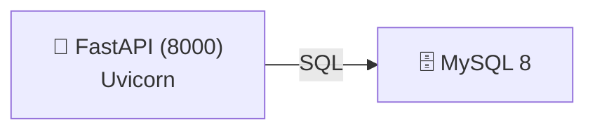

# API REST básica con FastAPI y MySQL

API REST base construida con FastAPI y MySQL. Proporciona la conexión con una base de datos MySQL. Expone un endpoint `health` para verificar el estado de la API y un endpoint raíz `/` que devuelve un mensaje de bienvenida con enlaces HATEOAS a los recursos disponibles. 

## Arquitectura



Dos servicios Docker:
| Servicio | Puerto | Descripción |
|----------|--------|-------------|
| `mysql`  | 3306   | Base de datos MySQL 8.0 con persistencia local |
| `python` | 8000   | API FastAPI + Uvicorn |

## Estructura del proyecto

```
api/
├── main.py              # Punto de entrada FastAPI
├── database.py          # Pool de conexiones MySQL
└── routes/
    └──  base.py          # GET / y GET /health
setup-environment/
├── docker-compose.yml
├── .env.example          # Ejemplo de variables de entorno
├── Dockerfile           # Imagen para la API
├── requirements.txt     # Dependencias de la API
data/
└── mysql-data/          # Volumen local MySQL (persistencia)
```

## Endpoints de la API

### Base
| Método | Ruta | Descripción |
|--------|------|-------------|
| GET | `/` | Bienvenida con enlaces HATEOAS |
| GET | `/health` | Health check |
| GET | `/docs` | Documentación Swagger UI |
| GET | `/redoc` | Documentación ReDoc |

## Puesta en marcha

### Requisitos previos
- Docker y Docker Compose

### 1. Variables de entorno

Crea el archivo `setup-environment/.env` (toma como base `setup-environment/.env.example`):

```env
MYSQL_ROOT_PASSWORD=<your-root-password>
MYSQL_DATABASE=<your-database-name>
MYSQL_USER=<your-username>
MYSQL_PASSWORD=<your-password>
```

### 2. Arrancar los servicios

```bash
cd setup-environment
docker-compose up --build -d
```

### 3. Verificar estado

```bash
docker-compose ps
docker-compose logs -f python   # logs de la API
```

**NOTA**

> Puedes usar Docker Desktop para gestionar los contenedores y volúmenes de forma visual.
> 
> El contenedor `python` contiene un servidor Uvicorn en modo de desarrollo, por lo que se reiniciará automáticamente al detectar cambios en el código fuente. Esto facilita el desarrollo iterativo sin necesidad de reconstruir la imagen cada vez.

### 4. Acceder a los servicios

| Servicio | URL |
|----------|-----|
| API | http://localhost:8000 |
| Documentación Swagger | http://localhost:8000/docs |
| Documentación ReDoc | http://localhost:8000/redoc |

## Comandos útiles

```bash
# Parar servicios
docker-compose down

# Reiniciar solo la API
docker-compose restart python

# Entrar al contenedor de la API
docker exec -it $(docker-compose ps -q python) /bin/sh

# Acceder a MySQL
docker exec -it mysql mysql -u root -p
```

## Dependencias principales

**API** (`requirements.txt`):
- `fastapi` — framework web
- `uvicorn` — servidor ASGI
- `mysql-connector-python` — driver MySQL
- `dotenv` — carga de variables de entorno
- `pydantic` — validación de datos
- `pytz` — manejo de zonas horarias

## Licencia

Este proyecto está licenciado bajo la Licencia CC BY-NC-ND 4.0. Esto significa que puedes compartir el proyecto siempre que cites al autor, no lo uses para fines comerciales y no realices obras derivadas.
